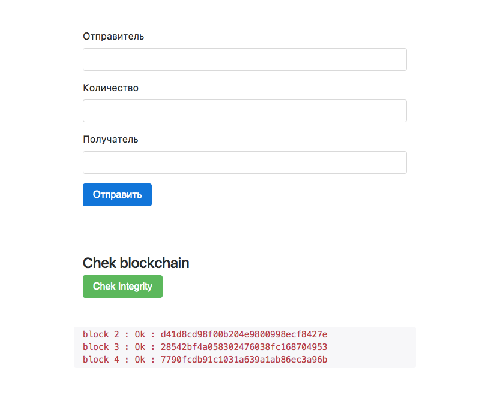

####Python simple blockchain

Простое представление реализации блокчейн.
Данные сохраняются в отдельных файлах. Что примечательно любое изменение файла, даже при последующем копировании исходных данных обратно после подмены, введет к нарушению целостности хешей блоков. 

- [x] кодировка 
- [x] проверка на целостность блоков 
- [x] выведение инфо
- [ ] еще  плюшки мб